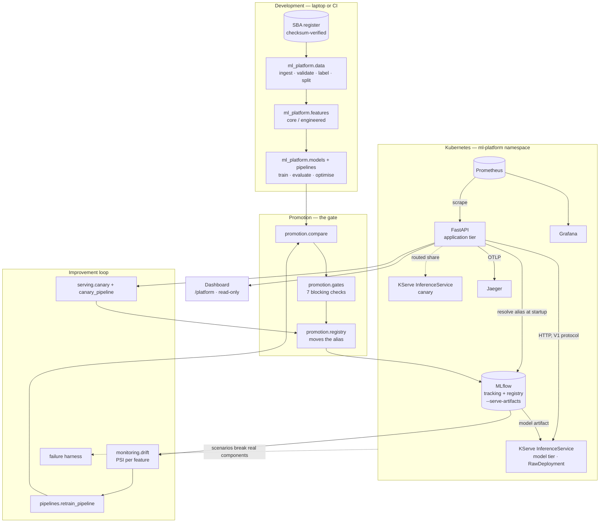
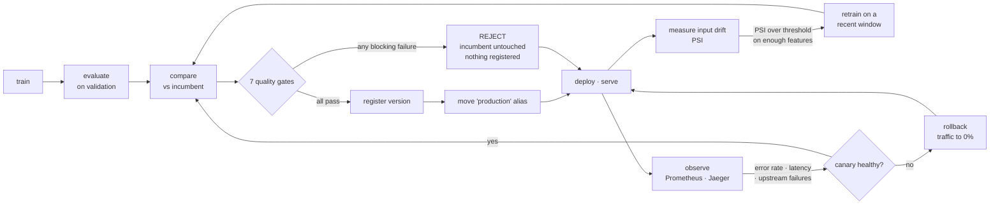
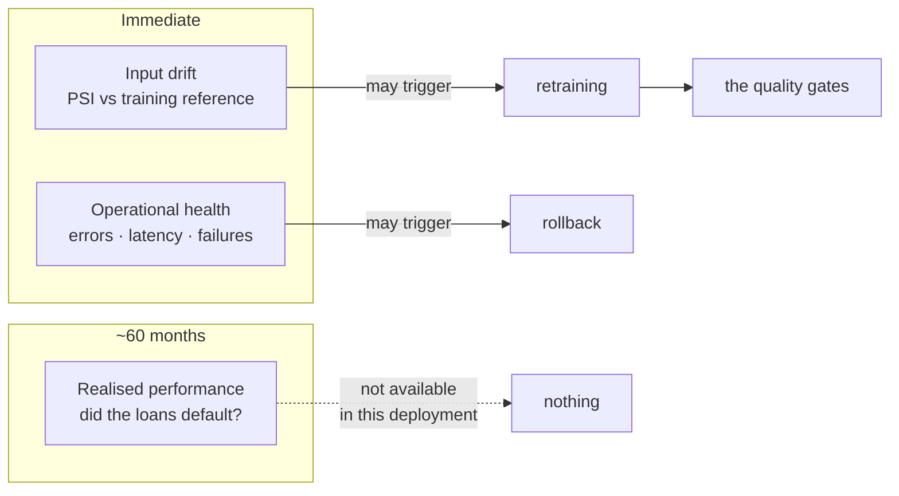
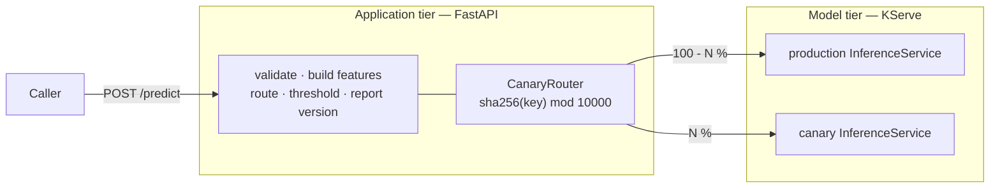

# Architecture

## What this system is for

It decides whether a newly trained model is genuinely better than the one in
production, and promotes it only if it is. Everything else exists to make that
decision trustworthy, observable and reversible.

The ML task is a vehicle: predicting whether an SBA-guaranteed loan will charge
off within 60 months of disbursement. The engineering is the point.

The rule the whole design serves:

> **A worse or unsafe model must never automatically replace a working
> production model.**

---

## System map

Everything the dashboard shows arrives through the FastAPI aggregation layer.
The browser never talks to MLflow, Prometheus or the Kubernetes API.

---

## The improvement lifecycle

The loop the platform exists to run. Solid arrows are automatic; dashed arrows
are operator commands.

Three properties of this diagram matter more than the boxes.

**Every path into production goes through the same gate.** A first candidate, a
retrained candidate and a canary that performed well all arrive at the same
seven checks. There is no edge that reaches "move the alias" without passing
through `D`.

**Drift points at `retrain`, not at `reject`.** A drift finding is a hypothesis
that a better model might now exist. It has no authority to remove the incumbent,
and in the one recorded case the retrained candidate lost — see
[evidence.md](evidence.md#2-promotion-a-better-model-refused).

**Rollback returns to `deploy`, not to `reject`.** Rolling back a canary says
nothing about whether the candidate is a good model; it says the candidate was
misbehaving operationally right now. Those are different findings.

---

## Three clocks

The reason the diagram above has three separate feedback edges rather than one.

The label is "defaulted within 60 months of disbursement", so a loan scored
today cannot be labelled until 2031. No realised-performance signal exists here
and none is simulated. This is why accuracy is not a rollback signal: a canary
waiting for it would never conclude.

---

## Serving tiers

**KServe owns the model artifact; FastAPI owns everything else.** Request
validation, feature building, the decision threshold and version reporting stay
in the application tier, because they are domain logic rather than model
serving.

**The split is done in the application tier because KServe cannot do it here.**
KServe runs in RawDeployment mode, which has no traffic-splitting primitive —
that belongs to the Knative-backed Serverless mode. Rather than pretend
otherwise, the routing is an explicit, deterministic hash in
`ml_platform.serving.canary`: the same caller lands on the same tier every time,
which is what makes any comparison between tiers meaningful. See
[kserve.md](kserve.md).

---

## Design commitments

**One pipeline object holds preprocessing and the estimator.** Imputation and
encoding are fitted on training data only and serialised with the model. This
removes the most common train/serve skew, where preprocessing is fitted
somewhere the served model cannot reach.

**Splits are time-ordered and the production window is quarantined.** Random
splitting would let 2008 approvals train a model evaluated on 2004. The
2006–mid-2009 window is never seen during development, so drift experiments run
against data the model genuinely has not met.

**Signals are separated by latency and authority.** Input drift, operational
health and realised performance arrive on different clocks and may make
different decisions. See [model_lifecycle.md](model_lifecycle.md).

**Configuration is layered and fingerprinted.** `base.yaml` plus an environment
overlay, hashed into every run record. In the cluster it arrives as a ConfigMap,
so no environment-specific value is baked into the image.

**Every run is self-describing.** The run record carries the git revision and
whether the tree was dirty, the config fingerprint, the dataset checksum, the
row-order fingerprint, the lockfile checksum, library versions, the seed, the
determinism settings, split composition and all metrics. A number without those
is not evidence.

**Results are locked and checked, not asserted.** `configs/reference.yaml` holds
the M1 metrics, split composition and row-order fingerprint;
`python -m ml_platform reproduce` retrains and compares, exiting non-zero on any
deviation. See [reproducibility.md](reproducibility.md).

**Nothing depends on the working directory.** Every path resolves from the
project root, and no absolute path is written into a run record.

**Validation precedes training.** A schema failure stops the pipeline before a
model is fitted, so a data problem cannot become a quietly degraded model.

**Observability cannot break inference.** Metric and trace exporters are
best-effort; a dead Prometheus or Jaeger is invisible to `/predict`. Proven by
the `telemetry_failure` scenario, which scales both to zero.

**Failing closed is success.** A service that answers 503 because its model tier
is gone has behaved correctly. One that answers 200 with a number it invented
has not, and that is far harder to notice. See [failure.md](failure.md).

**The dashboard reports; it does not decide.** All ten `/platform` endpoints are
read-only. Promotion, retraining, canary decisions and failure injection have
CLIs that carry the safety checks, and putting a button in front of them would
mean duplicating those checks or bypassing them.

---

## Technology, and what each one is for

Nothing is here to look impressive. Each entry names the requirement it
satisfies.

| Technology | Requirement it solves | Milestone |
|---|---|---|
| scikit-learn | Baseline and candidate tabular models in one serialisable pipeline | M1 |
| Pandera | Stop bad data before training; catch upstream schema changes | M1 |
| uv | Reproducible environment, pinned Python 3.12, locked dependencies | M1 |
| pytest | Prove the correctness-critical labelling, splitting and gate logic | M3 |
| MLflow | Compare experiments, version models, record promotion history | M4, M6 |
| Optuna | Systematic hyperparameter search with a recorded trial history | M5 |
| FastAPI + Pydantic | Domain-shaped request validation, health, model metadata | M7 |
| Docker | Reproducible execution of training and serving | M8 |
| GitHub Actions | Lint, types, tests, reproducibility and image build on every push | M9 |
| Kubernetes | Production-style orchestration, probes, config and rollout control | M10 |
| KServe | Canonical model serving, versioned model tier | M11 |
| Prometheus + Grafana | Request rate, latency, errors, prediction behaviour by tier | M12 |
| OpenTelemetry + Jaeger | Trace a prediction across the application and model tiers | M12 |
| Ruff + mypy | Lint, formatting and strict type checking | M1, M9 |
| React + Vite | The read-only operator dashboard | M16 |

A component that cannot be tied to a requirement here does not get added. Two
concrete refusals: no service mesh was introduced to obtain canary routing, and
no chaos-engineering framework was added to run six failure scenarios.

---

## Current state

M0 through M16 are implemented. Against the real 682,421-row register: the
production model is `sba-loan-default-classifier` v1 at 0.732 validation average
precision, 7 of 7 gates passed; 48 of 48 metrics reproduce bit-exactly under the
`strict` profile, and bit-exactly again on Linux in CI; the backend and dashboard
test suites pass in GitHub Actions; five failure scenarios have been run live
against the cluster and every invariant held. A hosted demo runs at
https://sba-mlops-platform.onrender.com.

Recorded numbers, caveats and limitations are in [evidence.md](evidence.md).
